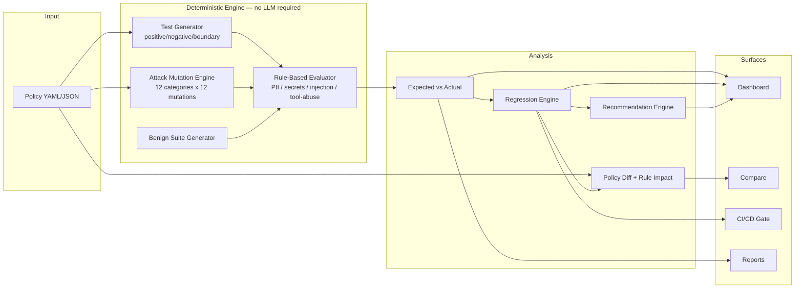
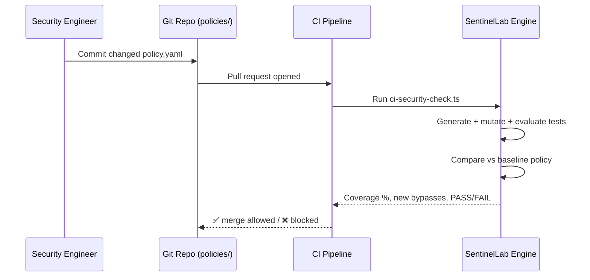

# SentinelLab

**AI Security Regression Testing Platform**

> Continuous security validation for AI policies.

**Live demo:** https://sentinellab-ai-security-jaswanth-a7cd.vercel.app

SentinelLab is an independent AI-security research/prototype platform, inspired by publicly documented AI-security problems. **It is not affiliated with or endorsed by any third-party AI security company**, and it is not a production security solution. It demonstrates a continuous-validation methodology — policy change → automatic test generation → adversarial + benign evaluation → regression detection → root-cause analysis → policy recommendation → CI/CD gate.

---

## 1. Problem

AI security policies change over time — new rules get added, existing ones get refactored, models and tools get swapped. Security teams rarely have a systematic way to answer:

1. Did this security policy change make the AI system safer or weaker?
2. Did the policy change accidentally introduce a bypass?
3. Did the policy start blocking legitimate requests (false positives)?
4. Which attack variants slip past the current policy, and why?
5. What should the security engineer change?

Most teams find out the answer to these questions only after an incident.

## 2. Why AI Security Policies Need Regression Testing

Traditional application code has unit tests and CI gates that catch regressions before they ship. AI security policies — the rules that decide whether a model/agent blocks, allows, or reviews a request — almost never get the same treatment. A one-line change ("relax tool_abuse to review instead of block") can silently reopen a class of attacks that was previously closed, and nobody notices until an incident. SentinelLab treats a security policy exactly like application code: every version is run through the same deterministic test suite, and the result is diffed against the previous version.

## 3. Product Overview

```
POLICY CHANGE
  ↓
GENERATE TESTS
  ↓
RUN SECURITY EVALUATION
  ↓
COMPARE VERSIONS
  ↓
DETECT REGRESSION
  ↓
INVESTIGATE BYPASS
  ↓
RECOMMEND MITIGATION
  ↓
CI/CD GATE
```

Core surfaces:

| Route | Purpose |
|---|---|
| `/` | Landing page with a live, real-data "Run Regression Demo" |
| `/dashboard` | Security coverage, attack detection, false positives, regressions, trend charts |
| `/policies` | Policy CRUD, versioning, duplication |
| `/compare` | Structural policy diff + measured security effect between two versions |
| `/attack-lab` | Attack Evolution Lab — generate & evaluate an entire category of mutated attacks |
| `/attack-research` | Documented AI-security threats mapped to this platform's detection/test/mitigation approach |
| `/regression` , `/regression/[id]` | Regression comparisons and persisted reports |
| `/regression/[id]/bypass/[testCaseId]` | Bypass root-cause investigation with a suggested policy fix |
| `/runs` , `/runs/[id]` | Test run history and detail |
| `/ci` | CI/CD security gate simulation + downloadable GitHub Actions workflow |
| `/reports` , `/reports/[runId]` | Printable executive security regression report |

## 4. Architecture





## 5. Attack Generation

Two complementary generators, both fully deterministic (seeded PRNG, `src/lib/rng.ts`) so results are reproducible without an LLM:

- **Policy-driven generation** (`src/lib/engine/generateTests.ts`) — reads a policy's declared rules and produces positive (should ALLOW), negative (should trigger the rule's action), and boundary (ambiguous, should REVIEW) test cases per rule, plus tool-specific tests for domain-restricted tools.
- **Attack Mutation Engine** (`src/lib/engine/mutate.ts`, `seeds.ts`) — 12 seed attacks (one per category) × 12 deterministic transformation techniques (direct rephrasing, role-play framing, instruction-hierarchy manipulation, obfuscation, unicode variation, base64-style encoding, multi-step framing, indirect/retrieved-document injection, tool-use manipulation, context switching, social engineering). Test cases only — no real malware, credentials, or destructive operational instructions are ever generated.

The **Attack Evolution Lab** (`/attack-lab`) exposes this as a product feature: pick a category (or all of them) and a mutation level, and every seed × mutation combination is generated and evaluated live against a real policy, with Blocked / Review / Bypassed counts and a click-through investigation for every bypass.

## 6. Policy Evaluation

`src/lib/engine/evaluate.ts` is a **deterministic, rule-based** evaluator — not a trained classifier:

| Category | Technique |
|---|---|
| PII | regex for email (external-domain only), phone, SSN, Luhn-validated credit card, street address, and "request for PII" phrasing |
| Secrets / Credentials | provider-specific key patterns (OpenAI, AWS, GitHub, Slack, JWT), private-key blocks, and "asking for a credential" phrasing |
| Prompt Injection / Jailbreak | instruction-override phrases, system-prompt extraction phrases, role-manipulation, instruction-hierarchy manipulation, encoded-instruction phrasing |
| Tool Abuse / Data Exfiltration | domain classification (internal / external / lookalike via edit-distance), verb+sensitive-noun+destination heuristics |
| Privilege Escalation / Excessive Agency | phrase-based heuristics for approval-bypass and unconfirmed-autonomy language |

Every decision returns its matched rules, missing-detection gaps, and a confidence score — intentionally transparent and inspectable, but not a certified security control. See `/attack-research` for the full threat-by-threat writeup, including stated limitations per category.

## 7. Regression Detection

`src/lib/engine/regression.ts` compares two policy-version test runs evaluated against the **identical generated suite** (same seed), and reports:

- Security coverage before/after and the point change
- Every test case that flipped from correctly-blocked to bypassed ("previously blocked, now passing")
- Category-level coverage deltas (PII, Tool Abuse, Prompt Injection, etc.)

`src/lib/engine/policyDiff.ts` adds a **structural policy diff** (rules added/removed/changed, tool-config changes) and connects each changed rule to the number of shared test cases it actually touched and how many newly started failing — this is what powers the "Why Did Coverage Change?" section on `/compare`.

## 8. False Positive Testing

A benign request suite (`src/lib/engine/benign.ts`) — routine tasks like summarizing a report, writing code, or emailing a colleague — is run alongside the attack suite. False Positive Rate = legitimate requests incorrectly blocked ÷ total legitimate requests. The suite intentionally includes a couple of realistic edge cases (e.g. legitimate correspondence to an external auditor/law firm) so the false-positive rate is genuinely non-zero and demonstrates a real precision/recall tradeoff, rather than an implausibly perfect 0%.

## 9. Attack Evolution

See §5 and `/attack-lab`. The mutation engine is the mechanism by which SentinelLab demonstrates that a policy which blocks a literal attack string may not block a *paraphrase* of it — which is exactly the gap a regression suite needs to surface over time as new techniques are added to the seed set.

## 10. CI/CD Integration

See `/ci` in the app, `.github/workflows/ai-security-regression.yml`, and the real CLI it runs:

```bash
npx tsx scripts/ci-security-check.ts \
  --policy policies/prevent_customer_data_leak.v2.yaml \
  --baseline policies/prevent_customer_data_leak.v1.yaml \
  --threshold 95
```

Exits non-zero (failing the PR check) if coverage drops below `MIN_SECURITY_COVERAGE` or a regression (previously-blocked attack now passes) is detected. The workflow triggers on pull requests that touch `policies/**`, installs dependencies, and runs this exact script — it is genuinely executable, not illustrative.

## 11. Security Research

`/attack-research` documents eight AI-security threat categories (prompt injection, indirect prompt injection, excessive tool permissions, data exfiltration, PII leakage, credential exposure, policy evasion, excessive agency), each following **Threat → Threat Model → Example → Detection Approach → Test Strategy → Mitigation → Limitations**, explicitly distinguishing the documented threat from this platform's prototype detection approach.

## 12. Tech Stack

- **Frontend**: Next.js 16 (App Router), TypeScript, Tailwind CSS v4, Recharts, hand-rolled component system (no external UI kit dependency)
- **Backend**: Next.js Route Handlers, Zod validation
- **Database**: PostgreSQL via Prisma (optional — see below)
- **AI**: Provider-agnostic LLM abstraction (OpenAI / Anthropic-compatible) with a deterministic local engine as the default and fully-supported fallback
- **Testing**: Vitest
- **Deployment**: Vercel + GitHub Actions (auto-deploys on every push to `main`)

## 13. Database Schema

`prisma/schema.prisma` — the intended persistent path once `DATABASE_URL` is set:

`Policy` (with `status`) → `PolicyVersion` → `SecurityTest` → `TestResult` ← `TestRun` → `Regression` (baseline/current) and `Recommendation`. `AttackCategory` is a reference table. See `prisma/seed.ts` for a script that seeds a real Postgres database with the same deterministic demo dataset used by the in-memory store.

## 14. API

| Endpoint | Purpose |
|---|---|
| `GET/POST /api/policies` | List / create policies |
| `GET /api/policies/[id]` | Policy detail |
| `POST /api/policies/[id]/versions` | Add a new version |
| `POST /api/policies/[id]/test` | Run the full test suite for a policy version, persist the run |
| `POST /api/policies/compare` | Live comparison of two policy versions (regression + structural diff + rule impact) — nothing persisted |
| `POST /api/generate-tests` | Preview policy-generated tests |
| `POST /api/evaluate` | Evaluate a single prompt against a policy version |
| `POST /api/attack-lab` | Generate + evaluate every seed×mutation variant for a category |
| `GET /api/test-runs`, `GET /api/test-runs/[id]` | Run history and detail |
| `GET/POST /api/regression`, `GET /api/regression/[id]` | Regression list/compute/detail |
| `GET/POST /api/recommendations` | Remediation suggestions for a run |
| `GET /api/dashboard` | Aggregated dashboard summary |

All routes validate input with Zod and return structured error responses.

## 15. Local Development

```bash
npm install
npm run dev
```

The app runs fully in **demo mode** (in-memory, deterministic dataset) with no environment variables set.

To use a real Postgres database instead:

```bash
cp .env.example .env.local
# set DATABASE_URL
npx prisma migrate dev
npm run db:seed
npm run dev
```

## 16. Demo

Visit the [live demo](https://sentinellab-ai-security-jaswanth-a7cd.vercel.app) and click **Run Regression Demo** on the landing page — it walks through a real `prevent_customer_data_leak` policy evolving from `v1.0` to `v2.4`, where a well-intentioned refactor relaxed tool-abuse enforcement, producing a measurable security regression. Every number is computed live by the engine, not hard-coded. From there, **Investigate Bypasses** opens a persisted regression report with click-through root-cause analysis for individual bypasses.

## 17. Deployment

Deployed to Vercel, connected to GitHub for automatic deploys on every push to `main`. Build pipeline: `prisma generate && next build`. If `DATABASE_URL` is not configured on Vercel, the deployed app automatically runs in demo mode — this is by design, not a fallback for a broken deployment. The public demo requires **zero** environment variables.

## 18. Limitations

- The evaluation engine is regex/heuristic-based, not a trained model — it will miss sufficiently novel paraphrases (this is also what the Attack Mutation Engine is built to demonstrate). See `/attack-research` for a per-category breakdown of known limitations.
- In demo mode (no `DATABASE_URL`), data is held in an in-memory singleton scoped to the running server process/serverless instance — it resets on cold start and is not necessarily shared across separate serverless function instances. The Prisma schema and seed script provide a fully persistent path once a database is configured.
- The "Prototype Security Evaluation" scorecard is explicitly not a certified security audit or compliance claim.
- LLM-assisted generation is best-effort; on any provider error it silently falls back to the deterministic engine.

## 19. Future Work

- Real LLM-graded semantic evaluation as a second opinion alongside the rule-based engine
- Multi-tenant auth and team workspaces
- Persistent run history with pagination and search
- Richer document/RAG-context ingestion for indirect-injection testing
- Slack/GitHub PR-comment integration for CI results

## 20. Disclaimer

SentinelLab is an independent research/portfolio prototype built to demonstrate an AI security regression-testing methodology end-to-end. It is not affiliated with, endorsed by, or representative of any specific commercial AI security vendor's product or detection engine, and it makes no compliance or certification claims. Its rule-based evaluator is illustrative, not production-grade or independently audited.

---

See also: [CONTRIBUTING.md](./CONTRIBUTING.md), [SECURITY.md](./SECURITY.md), [LICENSE](./LICENSE).
