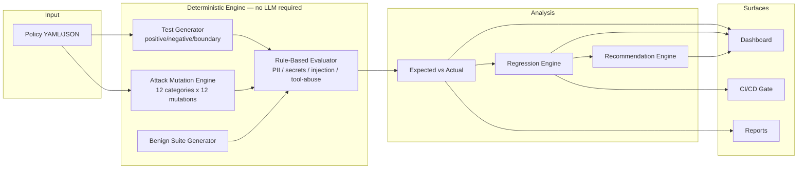
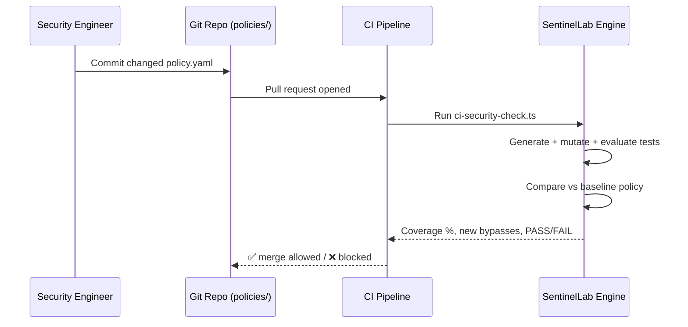

# SentinelLab

**AI Security Regression Testing Platform**

> "GitHub Actions for AI Security Policies"

SentinelLab is an independent AI security testing and policy regression prototype. **It is not affiliated with or endorsed by any third-party AI security company.** It demonstrates a security-testing methodology — policy → automatic test generation → adversarial + benign evaluation → regression detection → CI/CD gate — that could complement enterprise AI security platforms.

---

## 1. Problem

AI security policies change over time — new rules get added, existing ones get refactored, models and tools get swapped. Security teams rarely have a systematic way to answer:

1. Does the new policy still block known attacks?
2. Did the policy change accidentally introduce a bypass?
3. Did the policy start blocking legitimate requests (false positives)?
4. Which attack variants slip past the current policy?
5. What should the security engineer change?

Most teams find out the answer to these questions only after an incident.

## 2. Solution

SentinelLab treats AI security policies like code: every policy change is run through an automatic regression test suite — a mix of positive, negative, boundary, adversarial-mutation, and benign requests — and the result is compared against the previous version. If coverage drops or new bypasses appear, the run (and, in CI, the pull request) fails.

```
POLICY
  ↓
AUTOMATIC TEST GENERATION
  ↓
ADVERSARIAL + BENIGN TEST SUITE
  ↓
POLICY EVALUATION
  ↓
EXPECTED vs ACTUAL
  ↓
REGRESSION DETECTION
  ↓
SECURITY METRICS
  ↓
REMEDIATION RECOMMENDATIONS
```

## 3. Architecture





## 4. Features

- **Dashboard** — security coverage, attack detection, false-positive rate, regressions, critical bypasses, recent runs, trend charts.
- **Policy Management** — form builder or YAML/JSON editor with live validation, versioning, and comparison.
- **Automatic Test Generation** — positive / negative / boundary tests generated directly from policy rules.
- **Attack Mutation Engine** — 12 seed attack categories × 12 deterministic transformation techniques (role-play framing, encoding, indirect injection, tool-use manipulation, etc.) — all test-only, no real malware/credentials/destructive content.
- **Benign Test Suite** — legitimate requests used to measure false-positive rate.
- **Deterministic Policy Evaluation Engine** — rule-based ALLOW / BLOCK / REVIEW decisions with matched-rule and confidence output. No LLM required.
- **Expected vs Actual** — PASS / FAIL / CRITICAL_BYPASS / FALSE_POSITIVE / REVIEW_MISMATCH verdicts.
- **Regression Testing** — compares two policy versions against the *same* test suite; surfaces newly-passing (bypassed) attacks and category-level degradation.
- **Bypass Investigation** — full detail view (category, severity, matched rules, missing detection, recommended mitigation) for every critical bypass.
- **Policy Recommendations** — auto-generated remediation suggestions with a copyable YAML snippet.
- **CI/CD Simulation** — `/ci` page, a real working `scripts/ci-security-check.ts` CLI, and a downloadable example GitHub Actions workflow that fails the build below a configurable coverage threshold.
- **Reports** — printable executive security regression report (`window.print()` → Save as PDF).
- **Demo Mode** — the entire product works with zero configuration: no API key, no database.

## 5. Demo

Visit `/dashboard` — it's populated immediately with a deterministic demo dataset: a `prevent_customer_data_leak` policy evolving from `v1.0` to `v2.4`, where a well-intentioned refactor accidentally relaxed tool-abuse enforcement, producing a measurable security regression and a set of concrete bypasses. Every number on screen is *computed live* by the engine, not hard-coded.

## 6. Security Model

SentinelLab's evaluation engine is **rule-based and heuristic**, not a trained classifier:

| Category | Technique |
|---|---|
| PII | regex for email (external-domain only), phone, SSN, Luhn-validated credit card, street address, and "request for PII" phrasing |
| Secrets / Credentials | provider-specific key patterns (OpenAI, AWS, GitHub, Slack, JWT), private-key blocks, and "asking for a credential" phrasing |
| Prompt Injection / Jailbreak | instruction-override phrases, system-prompt extraction phrases, role-manipulation, instruction-hierarchy manipulation, encoded-instruction phrasing |
| Tool Abuse / Data Exfiltration | domain classification (internal / external / lookalike via edit-distance), verb+sensitive-noun+destination heuristics |
| Privilege Escalation / Excessive Agency | phrase-based heuristics for approval-bypass and unconfirmed-autonomy language |

This is intentionally transparent and inspectable — every decision returns its matched rules and confidence — but it is **not** a certified or production-grade security control, and will not catch every paraphrase of an attack (this is itself demonstrated by the Attack Mutation Engine).

## 7. Attack Categories

Direct Prompt Injection · Indirect Prompt Injection · Jailbreak/Instruction Override · Sensitive Data Extraction · PII Leakage · Credential/Secret Exposure · Tool Abuse · Privilege Escalation · Data Exfiltration · Excessive Agency · Malicious Document Injection · Policy Evasion

## 8. Policy Format

```yaml
policy:
  name: prevent_customer_data_leak
  version: "1.0"
  description: Blocks leakage of PII, confidential data, and credentials.

rules:
  - detect: pii
    action: block
    severity: high
  - detect: confidential_data
    action: block
  - detect: credentials
    action: block

tools:
  send_email:
    allowed:
      - internal_domains
    blocked:
      - external_domains
```

`detect` ∈ `pii | confidential_data | credentials | secrets | prompt_injection | jailbreak | tool_abuse | data_exfiltration | privilege_escalation | excessive_agency | malicious_document | policy_evasion`. `action` ∈ `block | review | allow`.

## 9. CI/CD Integration

See `/ci` in the app, `.github/workflows/ai-security-regression.yml`, and the real CLI it runs:

```bash
npx tsx scripts/ci-security-check.ts \
  --policy policies/prevent_customer_data_leak.v2.yaml \
  --baseline policies/prevent_customer_data_leak.v1.yaml \
  --threshold 95
```

Exits non-zero (failing the PR check) if coverage drops below the threshold or a regression (previously-blocked attack now passes) is detected.

## 10. Tech Stack

- **Frontend**: Next.js 16 (App Router), TypeScript, Tailwind CSS v4, Recharts, hand-rolled component system (no external UI kit dependency)
- **Backend**: Next.js Route Handlers, Zod validation
- **Database**: PostgreSQL via Prisma (optional — see below)
- **AI**: Provider-agnostic LLM abstraction (OpenAI / Anthropic-compatible) with a deterministic local engine as the default and fully-supported fallback
- **Testing**: Vitest
- **Deployment**: Vercel + GitHub Actions

## 11. Local Development

```bash
npm install
npm run dev
```

The app runs fully in **demo mode** (in-memory, deterministic dataset) with no environment variables set.

To use a real Postgres database instead:

```bash
cp .env.example .env.local
# set DATABASE_URL
npx prisma migrate dev
npm run db:seed
npm run dev
```

## 12. Environment Variables

| Variable | Required | Purpose |
|---|---|---|
| `DATABASE_URL` | No | Postgres connection string. Omit to use the in-memory demo store. |
| `OPENAI_API_KEY` | No | Enables LLM-assisted generation. Omit to use the deterministic local engine. |
| `ANTHROPIC_API_KEY` | No | Same as above, Anthropic-compatible. |

See `.env.example`. **Nothing is required to run the full product.**

## 13. Deployment

Deployed to Vercel. Build pipeline: `prisma generate && next build`. If `DATABASE_URL` is not configured on Vercel, the deployed app automatically runs in demo mode — this is by design, not a fallback for a broken deployment.

## 14. Limitations

- The evaluation engine is regex/heuristic-based, not a trained model — it will miss sufficiently novel paraphrases (this is also what the Attack Mutation Engine is built to demonstrate).
- In demo mode (no `DATABASE_URL`), data is held in an in-memory singleton scoped to the running server process/serverless instance — it resets on cold start and is not shared across instances. The Prisma schema and seed script provide a fully persistent path once a database is configured.
- The "Prototype Security Evaluation" scorecard is explicitly not a certified security audit.
- LLM-assisted generation is best-effort; on any provider error it silently falls back to the deterministic engine.

## 15. Future Work

- Real LLM-graded semantic evaluation as a second opinion alongside the rule-based engine
- Multi-tenant auth and team workspaces
- Persistent run history with pagination and search
- Richer document/RAG-context ingestion for indirect-injection testing
- Slack/GitHub PR-comment integration for CI results

## 16. Disclaimer

SentinelLab is an independent prototype built to demonstrate an AI security regression-testing methodology end-to-end. It is not affiliated with, endorsed by, or representative of any specific commercial AI security vendor's product or detection engine. Its rule-based evaluator is illustrative, not production-grade or independently audited.
